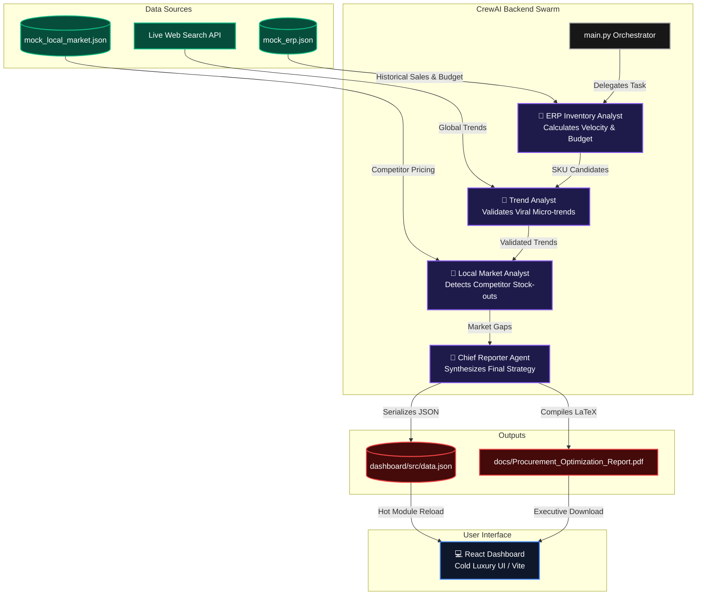

# StitchFlow AI Architecture

This diagram illustrates the autonomous multi-agent pipeline and the flow of data from mocked internal/external sources to the final React Dashboard and LaTeX reports.

